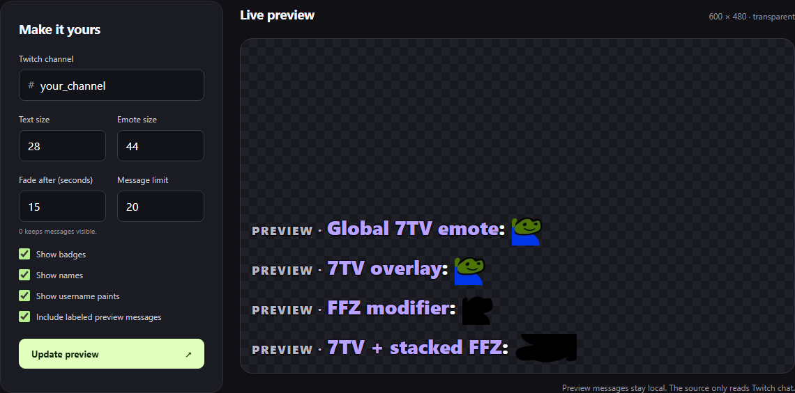
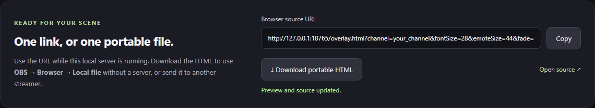

# Moltorino Chat Overlay

A transparent Twitch chat overlay that runs from one HTML file on your computer. It displays Twitch, FFZ, BTTV, and 7TV emotes, including stackable FFZ effects, 7TV layers, username paints, and custom badges. It reads public chat without a Twitch login.

[](https://github.com/markis-maximus/moltorino-chat-overlay/actions/workflows/ci.yml)

## Where it works

The overlay works with any streaming setup that can display a local HTML file or browser-source URL. The streaming service and encoder used after that browser layer do not matter because the overlay is already part of the finished picture.

- **Local browser file:** use the single downloaded HTML file in OBS or another application that accepts local browser sources.
- **Browser-source URL:** run the optional setup page and keep its small local server open while streaming.
- **Custom video pipeline:** render the HTML in a browser layer before the video is sent to the encoder.

FFmpeg alone cannot open HTML. A headless FFmpeg pipeline therefore needs a browser renderer or another browser-source layer before FFmpeg.

## Fastest setup

This method needs no installation and nothing else needs to stay open besides your streaming application.

1. [Download `chat-channelname.html`](https://github.com/markis-maximus/moltorino-chat-overlay/releases/latest/download/chat-channelname.html).
2. Rename it by replacing `channelname` with the Twitch channel. For example, channel `jynxzi` becomes `chat-jynxzi.html`.
3. Add a **Browser** source in your streaming application.
4. Enable **Local file** and select the renamed HTML file.
5. Start with a source width of **800** and height of **500**. Resize or crop it like any other scene source.

Four labeled examples appear for eight seconds and then clear themselves. Live messages appear as people chat. Refresh the browser source to show the examples again.

Keep the filename in this form:

```text
chat-your_twitch_name.html
```

Capital letters do not matter. Keep any underscores in the Twitch name. Internet access is required for Twitch chat, emotes, badges, and paints. The file cannot send chat messages and never asks for a Twitch password or OAuth token.

## Customize it with the setup page

Use the optional setup page to choose sizes, message behavior, and visible chat details before downloading your HTML file.

### 1. Start the setup page

1. Install [Node.js 18 or newer](https://nodejs.org/) if it is not already installed.
2. Download and extract the ZIP from [GitHub Releases](https://github.com/markis-maximus/moltorino-chat-overlay/releases/latest).
3. Start it:
   - **Windows:** double-click `start-overlay.cmd`.
   - **macOS or Linux:** open the extracted folder in Terminal and run `sh start-overlay.sh`.
4. Leave that terminal or command window open and visit **http://127.0.0.1:18765/** in your browser.

The page is available only on your computer. It does not create an internet-facing server.

### 2. Choose the settings



| Control | What it changes | Allowed values |
| --- | --- | --- |
| **Twitch channel** | The public Twitch chat to display. Enter the channel name without `twitch.tv/` or `#`. | 1–25 letters, numbers, or underscores |
| **Text size** | Chat message and username size in pixels. | 12–72; default 24 |
| **Emote size** | Normal emote height in pixels. Wide and animated effects can occupy more space. | 16–128; default 36 |
| **Fade after** | Starts fading each live message after this many seconds. | 0–3600; `0` keeps messages visible |
| **Message limit** | Maximum number of recent rows kept in the overlay. Rows may clear sooner when the source is full. | 1–100; default 30 |
| **Show badges** | Shows Twitch and supported third-party badges beside names. | On or off |
| **Show names** | Shows each chatter's display name. Turn it off for message-only chat. | On or off |
| **Show username paints** | Shows supported 7TV username colors, gradients, images, and shadows. | On or off |
| **Include labeled preview messages** | Shows four local effect examples for eight seconds whenever the source loads. | On or off |

Click **Update preview** after changing anything. The preview reloads with the new settings. It is transparent; the checkerboard exists only on the setup page to make that transparency visible.

### 3. Put the customized overlay in your stream



Choose either output:

- **Download portable HTML** saves `chat-yourchannel.html` with all current settings built in. Add it as a local browser file. After downloading, the setup page and Node.js can be closed.
- **Copy the Browser source URL** gives you a localhost address containing all current settings. Paste it into a URL-based browser source and keep `start-overlay.cmd` or `start-overlay.sh` running while streaming.

To change a portable file later, return to the setup page, choose the new settings, download it again, replace the old file, and refresh the browser source. For the URL method, click **Update preview**, copy the new URL, and replace the old source URL.

## Emotes and 7TV layers

The overlay loads channel and global emotes from Twitch, FFZ, BTTV, and 7TV. A recognized 7TV zero-width emote attaches visually to the emote before it instead of taking another space. For example:

| Input | Result |
| --- | --- |
| `ppL` | Global 7TV emote |
| `ppL RainTime` | `RainTime` layered over `ppL` |
| `ppL ffzW ffzCursed RainTime` | Wide and Cursed `ppL` with the 7TV layer applied to the composed image |

The four opening examples use global emotes so they work in every channel. `ppL` and `RainTime` are currently global 7TV emotes. Channel-specific layers work when that channel has enabled them.

## FFZ modifiers

Put a modifier immediately after an emote. Multiple modifiers and a 7TV layer can form one visual stack.

| Modifier | Effect | Behavior |
| --- | --- | --- |
| `ffzW` | Wide | Doubles the emote width, up to the renderer's safety cap. |
| `ffzX` | Flip horizontally | Mirrors the full composed emote from left to right. |
| `ffzY` | Flip vertically | Mirrors the full composed emote from top to bottom. |
| `ffzSpin` | Spin | Rotates continuously. |
| `ffzBounce` | Bounce | Repeatedly squashes, stretches, and hops. |
| `ffzJam` | Jam | Uses FFZ's short dancing motion and rotation. |
| `ffzSlide` | Slide | Scrolls repeated copies of the composed emote horizontally. |
| `ffzRainbow` | Rainbow | Continuously cycles the colors. |
| `ffzHyper` | Hyper | Applies FFZ's intense red, bright, saturated filter. |
| `ffzCursed` | Cursed | Applies dark, high-contrast grayscale. |
| `ffzArrive` | Arrive | Repeats FFZ's three-second entrance animation. |
| `ffzLeave` | Leave | Repeats FFZ's three-second exit animation. |

`ffzArrive ffzLeave` becomes one six-second enter-and-exit sequence. Motion, transition, flip, size, color, and 7TV-layer stages are kept separate so they can run together. For example, `WW ffzBounce ffzSpin ffzArrive ffzLeave ffzW` stays wide while it spins, bounces, arrives, and leaves.

The modifier chain belongs to the emote directly before it. Ordinary text ends the chain. Repeating the same effect does not multiply it. A full global example is:

```text
ppL ffzW ffzX ffzY ffzCursed RainTime
```

This renderer composes effects that FFZ's shared CSS transforms can otherwise replace. Exact frame timing can differ from a native chat client's renderer. Detailed provenance and modifier rules are in [research/ffz.md](research/ffz.md).

## Username paints and badges

The overlay supports Twitch badges, 7TV username paints and badges, Moltorino badges, Chatterino Homies animated badges, FFZ user badges, and channel-specific FFZ moderator or VIP badge images. Custom moderator badges retain the normal green moderator background.

Paints can contain colors, gradients, repeating gradients, image backgrounds, and shadows. Cosmetics load asynchronously, so a plain name or missing extra badge can briefly appear while a provider responds. Visible cosmetics update without restarting active emote animations.

History trimming measures actual message rows. Adding more FFZ motions or 7TV layers to one emote does not consume extra chat rows by itself. Wide emotes and text that truly wraps can still need more room.

See [research/cosmetics.md](research/cosmetics.md) for verified providers and current limitations.

## Future modifiers

Public emote catalogs reload every five minutes. The overlay reads FFZ's `modifier_flags` and `modifier_prefix`, including effect sets outside `default_sets`. New modifier names that combine already-supported effects can work without a code update. Unknown effect bits stay visible as text instead of silently disappearing. A brand-new animation type still requires renderer support.

A previously downloaded portable HTML file contains a snapshot of the overlay code. Download a new release when the renderer itself is updated.

## Verification and scope

The twelve listed modifier names were confirmed in Moltorino M15.5.2 and FFZ's global API. Animation definitions come from FFZ's official source. Tests cover modifier parsing, rendered dimensions, animation progress, stacked 7TV layers, Unicode chat offsets, provider loading, reconnects, moderation events, safe text rendering, every setup-page option, and generated portable files.

Automated browser checks use Chromium and run on Windows, macOS, and Linux. Other browser-source engines using modern web standards are expected to work, but have not all been independently tested.

This remains a focused Twitch overlay rather than a full ChatIS clone. It does not implement non-Twitch chat platforms or 7TV personal emote entitlements. FFZ effects modify the complete composited emote and layer stack.

## Development

Use Node.js 20 or newer for development and browser tests.

```text
npm install
npx playwright install chromium
npm test
npm run test:browser
node build.mjs --channel={channelname}
node server.mjs
```

Build output goes to `dist/`. There are no runtime npm dependencies; Playwright is used only for development tests. Windows, macOS, and Linux run the unit and offline browser suites in GitHub Actions. Provider schemas and read-only connection evidence are in [research/providers.md](research/providers.md).

Please report reproducible problems through [GitHub Issues](https://github.com/markis-maximus/moltorino-chat-overlay/issues) with the channel, exact message text, browser-source dimensions, and whether you used localhost or a standalone HTML file. Never include Twitch OAuth tokens or private account data.

Original overlay code is MIT licensed. Adapted FFZ keyframes are Apache-2.0 licensed; attribution and license text are included in every standalone file. Emote images retain their owners' rights.
